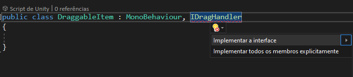

# Experimentos com Unity

## Sistema de Inventários

### Parte 1: Itens arrastáveis

Crie um Canvas

Crie uma imagem dentro do Canvas (UI > Image)

Agora vamos criar um script para arrastar os itens

Agora é preciso detectar quando o usuário clicar e arrastar a imagem

A bibiloteca `UnityEngine.EventSystems` contém algumas interfaces que podemos implementar para adicionar essa funcionalidade. Então vamos adicionar ela. Seu script deve ficar assim.

```c#
using UnityEngine;
using UnityEngine.EventSystems;

public class DraggableItem : MonoBehaviour
{
}
```

As interface da biblioteca `UnityEngine.EventSystems` permitem detectar clicks, drags, drops, entre outras coisas. Para detectar o drag é necessário implementar a interface `IDragHandler`. Seu script deve ficar assim, o VisualStudio deve apontar um erro, mas já entraremos nisso.

```c#
using UnityEngine;
using UnityEngine.EventSystems;

public class DraggableItem : MonoBehaviour, IDragHandler
{
}
```

Uma interface é como um contrato, ela especifica métodos que precisamos implementar. A interface `IDragHandler` obriga que o método `OnDrag` seja implementado. Ao inspecionar o erro, é possível ver a opção `Implementar a interface`.



Ao clicar no botão, seu código deve ficar assim:

```c#
public class DraggableItem : MonoBehaviour, IDragHandler
{
    public void OnDrag(PointerEventData eventData)
    {
        throw new System.NotImplementedException();
    }
}
```

Agora temos um método `OnDrag` que recebe como parâmetro um `PointerEventData`. A Unity irá chamar esse método toda vez que o usuário clicar e arrastar no objeto ao qual o script está vinculado e o parâmetro contém informações a respeito do evento do drag.

Para o nosso caso, usaremos a propriedade `delta`, que contém a informação de quanto o objeto se moveu desde a última vez que foi arrastado. Essa informação é um `Vector2`, isso por quê um elemento não pode ser arrastado no eixo Z (profundidade).

Usaremos a informação `delta` e adicionaremos ela no `position` do objeto que está sendo arrastado. O código vai ficar assim.

```c#
public void OnDrag(PointerEventData eventData)
{
	transform.position += (Vector3) eventData.delta;
}
```

Adicionamos o `(Vector3)` para converter a informação `delta` (que do tipo Vector2) em um Vector3, que é o tipo da propriedade `position`.

Com isso, já é possível ter o objeto sendo arrastado pelo mouse.

### Parte 2: Itens podem ser encaixados em slots